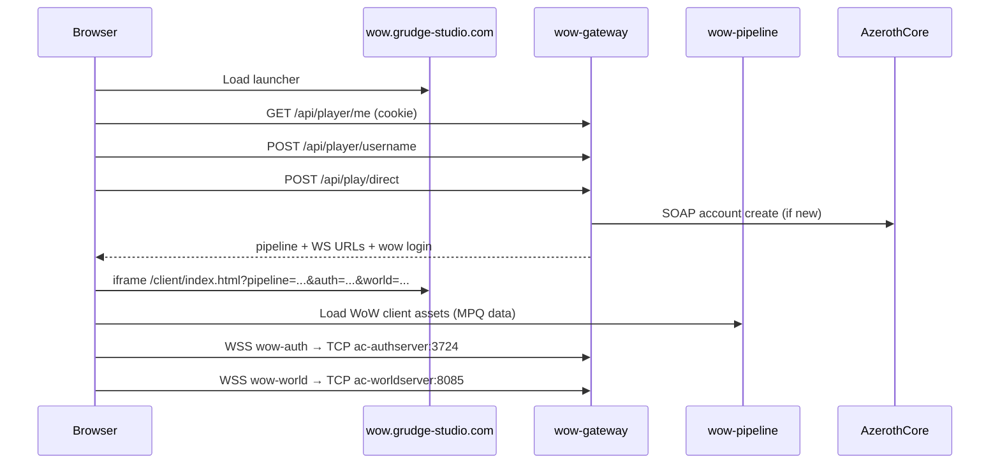

# Hosting, deploying, and playing Wowser

## Architecture tiers

| Tier | Host | Best for | Weakness |
|------|------|----------|----------|
| **Dev** | Your PC, native Node | Fast iteration | No public URLs without tunnel |
| **Home tunnel** | Your PC + Cloudflare tunnel | Current setup | Docker Desktop crashes = game offline |
| **VPS + Hub images** | Linux VPS + `docker-compose.hub.yml` | **Recommended production** | Monthly cost, AC data setup |
| **Build Cloud only** | Builds images in cloud | CI/CD | Still need a host to *run* containers |

**Rule:** Build Cloud builds images; it does not run your game server. You always need a machine running AzerothCore + gateway + pipeline.

---

## Part 1 — Docker Build Cloud (`cloud-connect`)

### Why it matters

Your PC’s Docker Desktop is unreliable. Build Cloud lets you push `grudgestudio/wow-grudge-gateway` and `wow-grudge-pipeline` images so any VPS can `docker pull` and run without building locally.

### One-time token setup

1. Open [Docker Admin Console](https://app.docker.com/) → switch to **grudgestudio** org (top-left).
2. **Admin Console → Access tokens** → edit **GrudgeBuilder** (or create new).
3. Enable **all** of these:

   | Scope | Why |
   |-------|-----|
   | **cloud-connect** | Use remote Build Cloud workers |
   | **Read public repositories** | Pull base images (`node:22-alpine`) |
   | **Image Push** on `wow-grudge-gateway` | Push gateway image |
   | **Image Push** on `wow-grudge-pipeline` | Push pipeline image |

4. Copy token → `.env`:

   ```
   DOCKERHUB_USERNAME=grudgestudio
   DOCKER_API_TOKEN_CLOUD=dckr_oat_...
   ```

5. Login username is **`grudgestudio`** — never `molochdadev` for org tokens.

### Builder access (pick one)

**Option A — Share personal builder (quick)**

- Owner `molochdadev` shares builder `grudgestudio` with grudgestudio org in [Build Cloud dashboard](https://app.docker.com/build/).
- Keep `.env`:

  ```
  DOCKER_BUILD_CLOUD_ENDPOINT=molochdadev/grudgestudio
  DOCKER_BUILDX_BUILDER=cloud-molochdadev-grudgestudio
  ```

**Option B — Org-owned builder (best practice)**

1. Create builder under **grudgestudio** at https://app.docker.com/build/
2. Update `.env`:

   ```
   DOCKER_BUILD_CLOUD_ENDPOINT=grudgestudio/<builder-name>
   DOCKER_BUILDX_BUILDER=cloud-grudgestudio-<builder-name>
   ```

### Build and verify

```powershell
.\scripts\verify-credentials.ps1   # Build Cloud line should be [ok]
.\scripts\docker-cloud-build.ps1
```

Success looks like:

```
[ok] pushed grudgestudio/wow-grudge-gateway:latest
[ok] pushed grudgestudio/wow-grudge-pipeline:latest
```

---

## Part 2 — Hosting best practices

### Recommended production layout

```
Vercel                    VPS (or stable home server)
wow.grudge-studio.com  →  cloudflared tunnel
                          ├─ wow-gateway :8787
                          ├─ wow-pipeline :3000
                          ├─ ac-authserver :3724
                          └─ ac-worldserver :8085 + SOAP :7878
```

### Do

| Practice | Detail |
|----------|--------|
| **Run on Linux VPS** | 8 GB+ RAM, 4 vCPU; Ubuntu 22.04+; Docker Engine (not Desktop) |
| **Use hub compose** | `docker compose -f docker-compose.hub.yml --env-file .env up -d` |
| **Persist player data** | Volume `wow-player-data` — maps Grudge ID → WoW login |
| **Persist AC data** | Keep `ac-database` volume; first boot takes 10–20 min |
| **Create SOAP admin once** | On worldserver console: `account create admin admin admin` then `account set gmlevel admin 3 -1` |
| **Tunnel on the same host as Docker** | cloudflared must point at `127.0.0.1:8787`, not a remote PC |
| **Rotate secrets** | OAT, Cloudflare token, SOAP password — see `docs/CREDENTIALS.md` |
| **Health checks** | `curl .../api/health`, `node scripts/test-flow.mjs` after deploy |

### Don’t

| Anti-pattern | Why |
|--------------|-----|
| Rely on Docker Desktop on a gaming PC | Crashes take wow-api offline for everyone |
| Build images on the game VPS | Slow; use Build Cloud + hub pull |
| Commit `.env` or `players.json` | Secrets and PII |
| Expose MySQL or SOAP to the internet | Only gateway/pipeline need public hostnames |
| Skip username onboarding | `play/direct` returns 409 without `grudgeUsername` |

### Cloudflare tunnel ingress

`cloudflared/config.yml` routes:

| Hostname | Local service |
|----------|---------------|
| `wow-api.grudge-studio.com` | `http://127.0.0.1:8787` |
| `wow-pipeline.grudge-studio.com` | `http://127.0.0.1:3000` |
| `wow-auth.grudge-studio.com` | `http://127.0.0.1:8787` (WS bridge → AC auth :3724) |
| `wow-world.grudge-studio.com` | `http://127.0.0.1:8787` (WS bridge → AC world :8085) |

Expand your Cloudflare API token with **Zone DNS Read** + **Cloudflare One Connectors Read** if you want API-managed DNS (see `docs/CREDENTIALS.md`).

### VPS deploy checklist

```bash
# On VPS
git clone <repo> && cd wow-grudge-studio
cp .env.example .env   # edit secrets

docker login -u grudgestudio
docker compose -f docker-compose.hub.yml --env-file .env up -d

# Install cloudflared, copy credentials + config.yml, run tunnel
cloudflared tunnel --config cloudflared/config.yml run wow-grudge
```

### Frontend (Vercel)

```powershell
cd frontend/site
vercel --prod
```

Launcher is static; it calls `wow-api.grudge-studio.com` with `credentials: 'include'` for Grudge ID cookies.

---

## Part 3 — Playing Wowser in the browser

### Player flow

```
1. Open https://wow.grudge-studio.com
2. Sign in → Grudge ID (id.grudge-studio.com)
3. Accept or set grudgeUsername
4. (Optional) View character list on launcher
5. Click Launch / Enter Azeroth
6. Wowser loads in iframe → connects to realm
```

### What happens under the hood



### URLs Wowser needs

| Param | Production value |
|-------|------------------|
| `pipeline` | `https://wow-pipeline.grudge-studio.com` |
| `auth` | `wss://wow-auth.grudge-studio.com` |
| `world` | `wss://wow-world.grudge-studio.com` |
| `realm` | `Grudge WoW` |
| `account` | Auto-provisioned WoW login |

### Prerequisites for play to work

| Requirement | How to check |
|-------------|--------------|
| Gateway online | `https://wow-api.grudge-studio.com/api/health` → `"status":"ok"` |
| Pipeline has client data | `https://wow-pipeline.grudge-studio.com/health` → `"status":"ok"` |
| Tunnel running | cloudflared process on Docker host |
| AzerothCore up | `docker compose ps` — auth + world healthy |
| SOAP admin exists | `play/direct` not `502 ECONNREFUSED` on 7878 |
| WoW 3.3.5a data extracted | `ac-client-data` volume populated (first compose run) |

### Local dev play

```powershell
.\start-all.ps1
# Open http://127.0.0.1:5173 or launcher with REQUIRE_GRUDGE_AUTH=false
```

Local Wowser uses `http://127.0.0.1:5173/` directly (not Vercel `/client` bundle).

### Wowser limitations (important)

Wowser is a **proof-of-concept** ([wowserhq/client](https://github.com/wowserhq/client)):

- Wrath 3.3.5a only
- Requires official client data served by pipeline
- UI/scene rendering is primitive; full realm gameplay may be incomplete
- BLP textures need conversion; network stack may not match a real WoW client end-to-end

Expect: launcher + auth + account provision + asset loading to work before full in-world play is guaranteed.

### Troubleshooting play

| Symptom | Likely cause | Fix |
|---------|--------------|-----|
| Gateway offline | Tunnel down or stack stopped | `.\start-all.ps1` or VPS `docker compose up -d` |
| 401 on launch | Grudge session expired | Sign out/in at id.grudge-studio.com |
| 409 username | Onboarding incomplete | Accept or set username in overlay |
| 502 play/direct | SOAP unreachable | Start AC worldserver; create admin SOAP account |
| Pipeline `missing-data` | Client data not extracted | Wait for first AC compose run or set `WOW_DATA_PATH` |
| Wowser blank / no connect | WS bridge down | Check wow-auth / wow-world DNS → tunnel → gateway |
| Works locally, not production | Tunnel on wrong machine | Run cloudflared on same host as Docker |

### Quick test (no browser)

```powershell
node scripts/test-flow.mjs
```

---

## Operational commands

```powershell
# Full stack (home)
.\start-all.ps1

# Build images (Build Cloud)
.\scripts\docker-cloud-build.ps1

# Deploy hub images
docker compose -f docker-compose.hub.yml --env-file .env up -d

# Verify all credentials
.\scripts\verify-credentials.ps1

# E2E auth + username + provision flow
node scripts/test-flow.mjs
```